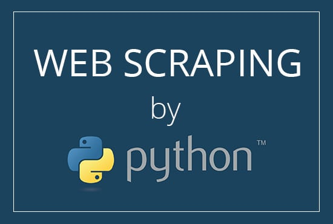

การทำ  **Web Scraping**  เพื่อเก็บข้อมูลที่มีอยู่ใน Internet มาทำการวิเคราะห์ เพราะสำหรับการวิเคราะห์ข้อมูล ซึ่งเป็นงานของ Data Scientist แล้ว สิ่งที่สำคัญที่สุดก็คงจะเป็น  _ข้อมูล_  นั่นแหละครับ  

นอกจากนี้ บริษัทใหญ่ ๆ หลาย ๆ แห่ง ก็ยังใช้ประโยชน์จากการทำ Web Scraping ในการเก็บรวบรวมความคิดเห็นของ social เพื่อเอามาวิเคราะห์ปรับปรุงผลิตภัณฑ์ของตัวเองได้อีกด้วย เช่น เก็บ complains ต่าง ๆ เกี่ยวกับผลิตภัณฑ์ในแต่ละชนิด หรือแม้กระทั่งการทำ sentiment analysis ด้วย technique NLP เพื่อดูว่า  _ความรู้สึก_  ของลูกค้าหลังการใช้บริการเป็นอย่างไร จาก comment หรือ post ต่าง ๆ ในโลกออนไลน์แบบ real-time

ในบทความนี้ก็เลยอยากจะเล่า flow ของการดูดข้อมูลแบบง่าย ๆ ซึ่งเหมาะสำหรับท่านที่พอจะเขียน Python ได้บ้างจนถึงชำนาญ และสนใจศึกษาเกี่ยวกับการทำ Web Scraping ครับ โดยในตัวอย่างนี้จะใช้เว็บ Wikipedia ซึ่งสามารถ scrape ได้ง่าย เหมาะกับผู้เริ่มต้นครับ

โดยในบทความนี้จะนำเสนอเพียงแค่ basic เพื่อให้ผู้อ่านได้เห็นภาพรวมกว้าง ๆ ก่อน และจะกลับมาอธิบายลงลึกในแต่ละส่วนแยกกันไปในบทความถัด ๆ ไปอีกทีครับ


## **Get Started!**

ก่อนอื่นจะขอแนะนำเครื่องมือที่ต้องใช้ก่อน จากนั้นก็จะแนะนำ flow ของการ scrape แบบง่าย ๆ พร้อมกับตัวอย่างโค้ดให้นำไปทดลองกันได้ง่าย ๆ ครับ

## **สึ่งที่ต้องเตรียม...**

**1. Python**  แน่นอนว่าถ้าจะเขียน Python script ก็ต้องมีโปรแกรมสำหรับ run script ก่อน ซึ่งตรงนี้สำหรับท่านที่ยังไม่มี Python ในเครื่อง ก็สามารถ install ได้จาก  [link นี้](https://www.python.org/downloads/)  โดยแนะนำให้ใช้ version ตั้งแต่  `3.6`  ขึ้นไปครับ

แต่ถ้าหากไม่สะดวก install ลงในเครื่องที่ใช้อยู่ก็สามารถ execute Python script online ได้โดยใช้บริการ  **Google Colab Notebook**  ของ Google ซึ่งสามารถแก้ไข และ execute Python script ทีละ block ได้ ผ่าน web browser จึงไม่จำเป็นต้อง install หรือ download อะไรลงในเครื่องทั้งสิ้นครับ

**โดยโค้ดทั้งหมดที่ใช้ในบทความนี้จะแชร์ผ่าน Google Colab ด้วยเช่นกัน เนื่องจาก Data Scientist ส่วนใหญ่น่าจะคุ้นเคยกับ interface ลักษณะนี้ดี**

[](https://res.cloudinary.com/practicaldev/image/fetch/s--KMRZMmU1--/c_limit%2Cf_auto%2Cfl_progressive%2Cq_auto%2Cw_880/https://dev-to-uploads.s3.amazonaws.com/i/1y2k0fb0qwubrbnfbj1u.png)  
_ภาพ Google Colab Notebook_

**2. modules สำหรับการ scrape**  Python modules ที่จำเป็นต้องใช้ในบทความนี้ ได้แก่  `requests`, และ  `lxml`  โดยสามารถ install ผ่านโปรแกรม  `pip`  ของ Python ได้จากคำสั่งต่อไปนี้  

```py
pip install requests lxml
```

**สำหรับท่านที่ใช้โค้ดบน Google Colab จะมี modules เหล่านี้ installed ไว้อยู่แล้ว ดังนั้นจึงไม่ต้องทำอะไรเพิ่มเติมครับ**

### **เริ่มกันเถอะ!**

code สำหรับบทความนี้จะแชร์ไว้ใน Google Colab ตาม  [link นี้](https://colab.research.google.com/drive/1CxGihPm5if8YGOEjrVo9havGikqqQa6e)  นะครับ  
ถ้าสะดวกสามารถเปิดโค้ดตามและทดลองแก้ไขและรันดูไปพร้อม ๆ กับที่อ่านบทความได้เลยนะครับ  
โดยการคลิกแทบ  `File`  ด้านบนของ Colab แล้วเลือก  `Save a copy in Drive...`  ก็จะสามารถแก้ไขได้ และ save ลง Google Drive ให้อัตโนมัติครับ  
ผู้อ่านสามารถรันโค้ดบน Colab ได้โดยการคลิกเลือกแต่ละ block แล้วกด  `Ctrl+Enter`

#### **Python Web Scraping**

สมมุติว่า เราต้องการจะดูดข้อมูลจาก  [https://th.wikipedia.org/wiki/รายชื่อเทศบาลตำบลในประเทศไทย](https://th.wikipedia.org/wiki/%E0%B8%A3%E0%B8%B2%E0%B8%A2%E0%B8%8A%E0%B8%B7%E0%B9%88%E0%B8%AD%E0%B9%80%E0%B8%97%E0%B8%A8%E0%B8%9A%E0%B8%B2%E0%B8%A5%E0%B8%95%E0%B8%B3%E0%B8%9A%E0%B8%A5%E0%B9%83%E0%B8%99%E0%B8%9B%E0%B8%A3%E0%B8%B0%E0%B9%80%E0%B8%97%E0%B8%A8%E0%B9%84%E0%B8%97%E0%B8%A2)  เพื่อเก็บรายชื่อของเทศบาลตำบลทั้งหมดในประเทศไทย ก็อาจจะแบ่งได้เป็น 2 ขั้นตอน คือ Scrape และ Extract

[](https://res.cloudinary.com/practicaldev/image/fetch/s--plYMCEN0--/c_limit%2Cf_auto%2Cfl_progressive%2Cq_auto%2Cw_880/https://dev-to-uploads.s3.amazonaws.com/i/ov86mmsfcop0q86h867m.png)  
_Wikipedia Page ที่จะทำการ scrape_

**1. Scrape**  ขั้นตอนแรกก็คือต้องเอาข้อมูลจากหน้าเว็บแบบดิบ ๆ เนี่ย ออกมาให้ได้ก่อน ซึ่งในเว็บอื่น ๆ ทั่ว ๆ ไป ก็จะมีความซับซ้อนหลาย ๆ อย่างที่ทำให้ไม่สามารถดึงออกมาได้ง่าย ๆ ซึ่งจะนำเสนอเทคนิคต่าง ๆ ที่ใช้รับมือแต่ละ cases ในบทความถัด ๆ ไปนะครับ  
แต่เนื่องจากในส่วนนี้เราใช้ Web Wikipedia เป็นตัวอย่าง ซึ่งไม่ได้มีการป้องการ scrape หรือกลไกที่ซับซ้อนอะไรมาก เพราะงั้นสามารถส่ง  `GET request`  ไปที่ URL โดยตรงตามโค้ดด้านล่างได้เลยครับ  

```py
import requests

url = 'https://th.wikipedia.org/wiki/รายชื่อเทศบาลตำบลในประเทศไทย'
resp = requests.get(url)
print(resp)

# Output: <Response [200]>
```

จากโค้ดด้านบนเราจะได้ object ของ  `Response`  มาเก็บไว้ในตัวแปร  `resp`  
โดยเราสามารถเรียกดู content ของ response ที่ได้กลับมาได้โดยใช้  `resp.content`  หรือ  `resp.text`  แตกต่างกันเล็กน้อย คือ  `.content`  จะให้ค่า content ที่เป็น bytes ออกมา ส่วน  `.text`  จะ decode ข้อมูล bytes ออกเป็น string ให้ จึงสามารถแสดงตัวอักษรภาษาต่าง ๆ ให้ดูได้ เช่นภาษาไทย  

```py
print(resp.text[:5_000])
```

คำสั่งด้านบนจะเรียกดูข้อมูลจำนวน 5,000 ตัวอักษรแรก (limit ไว้เพื่อไม่ให้มันรกเฉย ๆ)

จะเห็นว่าเราได้โค้ด HTML ของหน้า page นั้น ๆ มาทั้งหมด  
นั่นคือตอนนี้เราดึงข้อมูลดิบของหน้าเว็บนั้นมาอยู่ใน Python เรียบร้อยแล้ว

**2. Extract**  ต่อไปเราจะนำข้อมูลดิบที่ได้มา มากรองให้เหลือแค่ข้อมูลที่เราอยากได้เท่านั้น นั่นก็คือชื่อเทศบาลตำบล  
โดยทั่วไปในการ extract ข้อมูล วิธีการที่จะใช้นั้นก็ขึ้นอยู่กับหน้าตาของข้อมูล เช่น เป็น HTML, เป็น JSON, หรือเป็น plain text ซึ่ง modules ใน Python ที่จะนำมาใช้กับข้อมูลแต่ละประเภทก็มีหลายอย่าง เช่น  `lxml`,  `json`,  `beautifulsoup`, หรือ  `re`  
ในกรณีนี้ เนื่องจากข้อมูลดิบเราเป็น HTML ผู้เขียนจึงใช้  `lxml`  เนื่องจาก  `lxml`  มีฟังก์ชันที่ใช้แปลงข้อมูล HTML ให้กลายเป็น tree ซึ่งช่วยให้เราสามารถ extract แต่ละ element ใน HTML ได้ง่าย (เป็นความเห็นส่วนตัวนะครับ บางท่านอาจจะถนัดใช้ beautifulsoup มากกว่า ซึ่งอาจจะเขียนถึงในบทความถัด ๆ ไป)  

```py
import lxml.etree

content = resp.content
tree = lxml.etree.fromstring(content, parser=lxml.etree.HTMLParser())
print(tree)

# Output: <Element html at 0x7f34c830e948>

```

note: เราต้องระบุ  `parser`  ให้เป็น  `HTMLParser`  เนื่องจากจริง ๆ แล้ว  `lxml`  สามารถใช้กับข้อมูลประเภทอื่นนอกจาก HTML ได้ด้วย

พอเราแปลงข้อมูลเป็น tree แล้ว ต่อไปเราก็จะสามารถระบุตำแหน่งของ element ที่เก็บข้อมูลที่เราต้องการได้โดยใช้  `XPath`  
อธิบายแบบคร่าว ๆ  `XPath`  ก็คล้าย ๆ กับ path ของ folder ต่าง ๆ ในเครื่องคอมพิวเตอร์ ที่เอาไว้ระบุตำแหน่งไฟล์หรือ folder ที่เราต้องการ โดยเริ่มจาก  _root_  (C:/) แล้วก็ไปยัง folder ต่าง ๆ ตามลำดับ เช่น  _C:/Users/CopyPasteEng/Downloads_  แต่  `XPath`  ในที่นี้จะใช้ระบุตำแหน่งของ HTML element บนโค้ด code แทน  
ตัวอย่าง  `XPath`  เช่น  `//div[@id="mw-content-text"]/div/p/text()`  อันนี้จะแปลว่า  

```
1. ให้เข้าไปหา element ประเภท div ที่มี id เป็น "mw-content-text"
2. จากนั้นเข้าต่อไปที่ child element ที่เป็นประเภท div
3. แล้วก็เข้าต่อไปที่ element ประเภท p
4. แล้วเอา content ที่เป็น text ทั้งหมดออกมา

```

note:  `div[...]`  คือการใส่เงื่อนไขในการเลือก  `div`  นั้น ๆ เข้าไป ในกรณีด้านบน เงื่อนไขก็คือ attribute  _id_  ต้องเท่ากับ  `mw-content-text`

ทีนี้คำถามต่อมาก็คือจะเอา  `XPath`  ที่บอกตำแหน่งของข้อมูลที่เราต้องการมาได้อย่างไร  
คำตอบก็คือต้องดูจาก code ของ page ครับ ไม่มีทางอื่น 555  
ซึ่งเครื่องมือหนึ่งที่สามารถช่วยให้แกะโค้ดของ web ต่าง ๆ ได้ง่าย ๆ และฟรี ก็คือ  **Code Inspector**  บน  **Google Chrome**  ครับ สามารถเปิดขึ้นมาได้โดยคลิกขวาที่หน้าเว็บแล้วเลือก  `Inspect`  หรือกด  `F12`

กลับมาที่เว็บตัวอย่างของเราครับ  `XPath`  ของชื่อเทศบาลตำบลทั้งหมดที่เราต้องการก็คือ  `//*[@id="mw-content-text"]/div/table[2 <= position()]/tbody/tr/td[2 <= position() and position() <= 3]//a//text()`* เราจึงสามารถที่จะ extract ข้อมูลออกจาก tree ได้ด้วยคำสั่งต่อไปนี้ ก็จะได้ชื่อของเทศบาลตำบลในประเทศไทยจาก Wikipedia มาเก็บเป็น list เอาไว้ได้ตามต้องการครับ  

```py
xpath = '//*[@id="mw-content-text"]/div/table[2 <= position()]/tbody/tr/td[2 <= position() and position() <= 3]//a//text()'
tambon_list = tree.xpath(xpath)
print(tambon_list)

# Output: ['เทศบาลตำบลบ้านดู่', 'เทศบาลตำบลเวียงชัย', ...

```

_*ขออนุญาตแก้ XPath ในตัวอย่างนี้เป็นแบบที่ยาวขึ้น เพื่อให้อธิบายได้ง่ายในบทความ part 2 นะครับ_

**เพื่อให้บทความกระชับ ผู้จัดทำได้ละรายละเอียดบางส่วนเอาไว้  
เพราะจริง ๆ แล้ว ทั้งในส่วนของการ scrape และ extract ก็มีรายละเอียดอีกมาก และมีเทคนิคที่อาจจะต้องใช้มากมายซึ่งแตกต่างกันตามแต่ละ website เช่น  `XPath`  ที่อยู่ใน code นี่ได้มาได้ยังไง? จะทำอย่างไรกับบาง website ที่มีกลไกที่ป้องกันการ scraping หรือบาง website ที่มี format ขอข้อมูลเป็นลักษณะอื่น**

**เพื่อให้ผู้อ่านได้รับข้อมูลครบถ้วน ในบทความนี้จึงนำเสนอเพียงแค่ basic ให้ผู้อ่านได้เห็นภาพรวมกว้าง ๆ ก่อน และคิดว่าจะกลับมาอธิบายลงลึกในแต่ละส่วนแยกกันไปอีกทีครับ**

## Summary

คิดว่าจากบทความนี้ ผู้อ่านน่าจะได้เห็นภาพของการ scrape แบบง่าย ๆ ไปแล้วสำหรับการเริ่มต้น ในบทความถัดไปเราก็จะสามารถไปดูเคสที่ซับซ้อนกันต่อได้ครับ

อย่างที่ได้กล่าวไปข้างต้นครับ ว่าในการวิเคราะห์ข้อมูลเพื่อทำนายเหตุการณ์ต่าง ๆ ให้ถูกต้องและแม่นยำสิ่งที่สำคัญที่สุดคือ  **ข้อมูล**  ที่อัพเดตตลอดเวลา  
ซึ่งเราอาจจะมอง Internet เป็นเหมือนแหล่งข้อมูลฟรี ที่เราสามารถ scrape มายังไงก็ได้  **แต่ควรคำนึงถึงเรื่องของกฎหมายและความเหมาะสมด้วยครับ สิ่งสำคัญก็คือต้องไม่ทำให้ใครเดือดร้อน**

และสำหรับท่านที่สนใจอยากทราบรายละเอียดของแต่ละขั้นตอนอย่างละเอียด ก็สามารถติดตามได้ในบทความที่จะลงต่อ ๆ ไปนะครับ

หรือถ้ามีเรื่องไหนที่สนใจเพิ่มเติมสามารถ comment เอาไว้ได้นะครับ

FB Page:  [Copy Paste Engineer](https://www.facebook.com/CopyPasteEng)  


**Part อื่น ๆ ใน series**  

- [Part II - Chrome's Code Inspector](../python-web-scraping-part-2/)
- [Part III - เทคนิคการ extract ข้อมูลด้วย XPath](../python-web-scraping-part-3/)
- [Part IV - ทำไมถึง scrape บางเว็บไม่ได้](../python-web-scraping-part-4/)

> Reference : [https://dev.to/copypasteengineer/](https://dev.to/copypasteengineer/python-web-scraping-part-1-python-49ce)