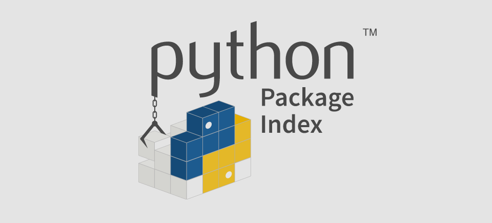

While  [The Python Language Reference](https://docs.python.org/3.8/reference/index.html#reference-index)  describes the exact syntax and semantics of the Python language, this library reference manual describes the standard library that is distributed with Python. It also describes some of the optional components that are commonly included in Python distributions.

Python’s standard library is very extensive, offering a wide range of facilities as indicated by the long table of contents listed below. The library contains built-in modules (written in C) that provide access to system functionality such as file I/O that would otherwise be inaccessible to Python programmers, as well as modules written in Python that provide standardized solutions for many problems that occur in everyday programming. Some of these modules are explicitly designed to encourage and enhance the portability of Python programs by abstracting away platform-specifics into platform-neutral APIs.

The Python installers for the Windows platform usually include the entire standard library and often also include many additional components. For Unix-like operating systems Python is normally provided as a collection of packages, so it may be necessary to use the packaging tools provided with the operating system to obtain some or all of the optional components.

In addition to the standard library, there is a growing collection of several thousand components (from individual programs and modules to packages and entire application development frameworks), available from the  [Python Package Index](https://pypi.org/).

-   [Introduction](https://docs.python.org/3.8/library/intro.html)
    -   [Notes on availability](https://docs.python.org/3.8/library/intro.html#notes-on-availability)
-   [Built-in Functions](https://devdocs.io/python~3.8/library/functions)
-   [Built-in Constants](https://devdocs.io/python~3.8/library/constants)
    -   [Constants added by the  `site`  module](https://devdocs.io/python~3.8/library/constants#constants-added-by-the-site-module)
-   [Built-in Types](https://devdocs.io/python~3.8/library/stdtypes)
    -   [Truth Value Testing](https://devdocs.io/python~3.8/library/stdtypes#truth-value-testing)
    -   [Boolean Operations —  `and`,  `or`,  `not`](https://devdocs.io/python~3.8/library/stdtypes#boolean-operations-and-or-not)
    -   [Comparisons](https://devdocs.io/python~3.8/library/stdtypes#comparisons)
    -   [Numeric Types —  `int`,  `float`,  `complex`](https://devdocs.io/python~3.8/library/stdtypes#numeric-types-int-float-complex)
    -   [Iterator Types](https://devdocs.io/python~3.8/library/stdtypes#iterator-types)
    -   [Sequence Types —  `list`,  `tuple`,  `range`](https://devdocs.io/python~3.8/library/stdtypes#sequence-types-list-tuple-range)
    -   [Text Sequence Type —  `str`](https://devdocs.io/python~3.8/library/stdtypes#text-sequence-type-str)
    -   [Binary Sequence Types —  `bytes`,  `bytearray`,  `memoryview`](https://devdocs.io/python~3.8/library/stdtypes#binary-sequence-types-bytes-bytearray-memoryview)
    -   [Set Types —  `set`,  `frozenset`](https://devdocs.io/python~3.8/library/stdtypes#set-types-set-frozenset)
    -   [Mapping Types —  `dict`](https://devdocs.io/python~3.8/library/stdtypes#mapping-types-dict)
    -   [Context Manager Types](https://devdocs.io/python~3.8/library/stdtypes#context-manager-types)
    -   [Other Built-in Types](https://devdocs.io/python~3.8/library/stdtypes#other-built-in-types)
    -   [Special Attributes](https://devdocs.io/python~3.8/library/stdtypes#special-attributes)
-   [Built-in Exceptions](https://devdocs.io/python~3.8/library/exceptions)
    -   [Base classes](https://devdocs.io/python~3.8/library/exceptions#base-classes)
    -   [Concrete exceptions](https://devdocs.io/python~3.8/library/exceptions#concrete-exceptions)
    -   [Warnings](https://devdocs.io/python~3.8/library/exceptions#warnings)
    -   [Exception hierarchy](https://devdocs.io/python~3.8/library/exceptions#exception-hierarchy)
-   [Text Processing Services](https://devdocs.io/python~3.8/library/text)
    -   [`string`  — Common string operations](https://devdocs.io/python~3.8/library/string)
    -   [`re`  — Regular expression operations](https://devdocs.io/python~3.8/library/re)
    -   [`difflib`  — Helpers for computing deltas](https://devdocs.io/python~3.8/library/difflib)
    -   [`textwrap`  — Text wrapping and filling](https://devdocs.io/python~3.8/library/textwrap)
    -   [`unicodedata`  — Unicode Database](https://devdocs.io/python~3.8/library/unicodedata)
    -   [`stringprep`  — Internet String Preparation](https://devdocs.io/python~3.8/library/stringprep)
    -   [`readline`  — GNU readline interface](https://devdocs.io/python~3.8/library/readline)
    -   [`rlcompleter`  — Completion function for GNU readline](https://devdocs.io/python~3.8/library/rlcompleter)
-   [Binary Data Services](https://devdocs.io/python~3.8/library/binary)
    -   [`struct`  — Interpret bytes as packed binary data](https://devdocs.io/python~3.8/library/struct)
    -   [`codecs`  — Codec registry and base classes](https://devdocs.io/python~3.8/library/codecs)
-   [Data Types](https://devdocs.io/python~3.8/library/datatypes)
    -   [`datetime`  — Basic date and time types](https://devdocs.io/python~3.8/library/datetime)
    -   [`calendar`  — General calendar-related functions](https://devdocs.io/python~3.8/library/calendar)
    -   [`collections`  — Container datatypes](https://devdocs.io/python~3.8/library/collections)
    -   [`collections.abc`  — Abstract Base Classes for Containers](https://devdocs.io/python~3.8/library/collections.abc)
    -   [`heapq`  — Heap queue algorithm](https://devdocs.io/python~3.8/library/heapq)
    -   [`bisect`  — Array bisection algorithm](https://devdocs.io/python~3.8/library/bisect)
    -   [`array`  — Efficient arrays of numeric values](https://devdocs.io/python~3.8/library/array)
    -   [`weakref`  — Weak references](https://devdocs.io/python~3.8/library/weakref)
    -   [`types`  — Dynamic type creation and names for built-in types](https://devdocs.io/python~3.8/library/types)
    -   [`copy`  — Shallow and deep copy operations](https://devdocs.io/python~3.8/library/copy)
    -   [`pprint`  — Data pretty printer](https://devdocs.io/python~3.8/library/pprint)
    -   [`reprlib`  — Alternate  `repr()`  implementation](https://devdocs.io/python~3.8/library/reprlib)
    -   [`enum`  — Support for enumerations](https://devdocs.io/python~3.8/library/enum)
-   [Numeric and Mathematical Modules](https://devdocs.io/python~3.8/library/numeric)
    -   [`numbers`  — Numeric abstract base classes](https://devdocs.io/python~3.8/library/numbers)
    -   [`math`  — Mathematical functions](https://devdocs.io/python~3.8/library/math)
    -   [`cmath`  — Mathematical functions for complex numbers](https://devdocs.io/python~3.8/library/cmath)
    -   [`decimal`  — Decimal fixed point and floating point arithmetic](https://devdocs.io/python~3.8/library/decimal)
    -   [`fractions`  — Rational numbers](https://devdocs.io/python~3.8/library/fractions)
    -   [`random`  — Generate pseudo-random numbers](https://devdocs.io/python~3.8/library/random)
    -   [`statistics`  — Mathematical statistics functions](https://devdocs.io/python~3.8/library/statistics)
-   [Functional Programming Modules](https://devdocs.io/python~3.8/library/functional)
    -   [`itertools`  — Functions creating iterators for efficient looping](https://devdocs.io/python~3.8/library/itertools)
    -   [`functools`  — Higher-order functions and operations on callable objects](https://devdocs.io/python~3.8/library/functools)
    -   [`operator`  — Standard operators as functions](https://devdocs.io/python~3.8/library/operator)
-   [File and Directory Access](https://devdocs.io/python~3.8/library/filesys)
    -   [`pathlib`  — Object-oriented filesystem paths](https://devdocs.io/python~3.8/library/pathlib)
    -   [`os.path`  — Common pathname manipulations](https://devdocs.io/python~3.8/library/os.path)
    -   [`fileinput`  — Iterate over lines from multiple input streams](https://devdocs.io/python~3.8/library/fileinput)
    -   [`stat`  — Interpreting  `stat()`  results](https://devdocs.io/python~3.8/library/stat)
    -   [`filecmp`  — File and Directory Comparisons](https://devdocs.io/python~3.8/library/filecmp)
    -   [`tempfile`  — Generate temporary files and directories](https://devdocs.io/python~3.8/library/tempfile)
    -   [`glob`  — Unix style pathname pattern expansion](https://devdocs.io/python~3.8/library/glob)
    -   [`fnmatch`  — Unix filename pattern matching](https://devdocs.io/python~3.8/library/fnmatch)
    -   [`linecache`  — Random access to text lines](https://devdocs.io/python~3.8/library/linecache)
    -   [`shutil`  — High-level file operations](https://devdocs.io/python~3.8/library/shutil)
-   [Data Persistence](https://devdocs.io/python~3.8/library/persistence)
    -   [`pickle`  — Python object serialization](https://devdocs.io/python~3.8/library/pickle)
    -   [`copyreg`  — Register  `pickle`  support functions](https://devdocs.io/python~3.8/library/copyreg)
    -   [`shelve`  — Python object persistence](https://devdocs.io/python~3.8/library/shelve)
    -   [`marshal`  — Internal Python object serialization](https://devdocs.io/python~3.8/library/marshal)
    -   [`dbm`  — Interfaces to Unix “databases”](https://devdocs.io/python~3.8/library/dbm)
    -   [`sqlite3`  — DB-API 2.0 interface for SQLite databases](https://devdocs.io/python~3.8/library/sqlite3)
-   [Data Compression and Archiving](https://devdocs.io/python~3.8/library/archiving)
    -   [`zlib`  — Compression compatible with  **gzip**](https://devdocs.io/python~3.8/library/zlib)
    -   [`gzip`  — Support for  **gzip**  files](https://devdocs.io/python~3.8/library/gzip)
    -   [`bz2`  — Support for  **bzip2**  compression](https://devdocs.io/python~3.8/library/bz2)
    -   [`lzma`  — Compression using the LZMA algorithm](https://devdocs.io/python~3.8/library/lzma)
    -   [`zipfile`  — Work with ZIP archives](https://devdocs.io/python~3.8/library/zipfile)
    -   [`tarfile`  — Read and write tar archive files](https://devdocs.io/python~3.8/library/tarfile)
-   [File Formats](https://devdocs.io/python~3.8/library/fileformats)
    -   [`csv`  — CSV File Reading and Writing](https://devdocs.io/python~3.8/library/csv)
    -   [`configparser`  — Configuration file parser](https://devdocs.io/python~3.8/library/configparser)
    -   [`netrc`  — netrc file processing](https://devdocs.io/python~3.8/library/netrc)
    -   [`xdrlib`  — Encode and decode XDR data](https://devdocs.io/python~3.8/library/xdrlib)
    -   [`plistlib`  — Generate and parse Mac OS X  `.plist`  files](https://devdocs.io/python~3.8/library/plistlib)
-   [Cryptographic Services](https://devdocs.io/python~3.8/library/crypto)
    -   [`hashlib`  — Secure hashes and message digests](https://devdocs.io/python~3.8/library/hashlib)
    -   [`hmac`  — Keyed-Hashing for Message Authentication](https://devdocs.io/python~3.8/library/hmac)
    -   [`secrets`  — Generate secure random numbers for managing secrets](https://devdocs.io/python~3.8/library/secrets)
-   [Generic Operating System Services](https://devdocs.io/python~3.8/library/allos)
    -   [`os`  — Miscellaneous operating system interfaces](https://devdocs.io/python~3.8/library/os)
    -   [`io`  — Core tools for working with streams](https://devdocs.io/python~3.8/library/io)
    -   [`time`  — Time access and conversions](https://devdocs.io/python~3.8/library/time)
    -   [`argparse`  — Parser for command-line options, arguments and sub-commands](https://devdocs.io/python~3.8/library/argparse)
    -   [`getopt`  — C-style parser for command line options](https://devdocs.io/python~3.8/library/getopt)
    -   [`logging`  — Logging facility for Python](https://devdocs.io/python~3.8/library/logging)
    -   [`logging.config`  — Logging configuration](https://devdocs.io/python~3.8/library/logging.config)
    -   [`logging.handlers`  — Logging handlers](https://devdocs.io/python~3.8/library/logging.handlers)
    -   [`getpass`  — Portable password input](https://devdocs.io/python~3.8/library/getpass)
    -   [`curses`  — Terminal handling for character-cell displays](https://devdocs.io/python~3.8/library/curses)
    -   [`curses.textpad`  — Text input widget for curses programs](https://devdocs.io/python~3.8/library/curses#module-curses.textpad)
    -   [`curses.ascii`  — Utilities for ASCII characters](https://devdocs.io/python~3.8/library/curses.ascii)
    -   [`curses.panel`  — A panel stack extension for curses](https://devdocs.io/python~3.8/library/curses.panel)
    -   [`platform`  — Access to underlying platform’s identifying data](https://devdocs.io/python~3.8/library/platform)
    -   [`errno`  — Standard errno system symbols](https://devdocs.io/python~3.8/library/errno)
    -   [`ctypes`  — A foreign function library for Python](https://devdocs.io/python~3.8/library/ctypes)
-   [Concurrent Execution](https://devdocs.io/python~3.8/library/concurrency)
    -   [`threading`  — Thread-based parallelism](https://devdocs.io/python~3.8/library/threading)
    -   [`multiprocessing`  — Process-based parallelism](https://devdocs.io/python~3.8/library/multiprocessing)
    -   [`multiprocessing.shared_memory`  — Provides shared memory for direct access across processes](https://devdocs.io/python~3.8/library/multiprocessing.shared_memory)
    -   [The  `concurrent`  package](https://devdocs.io/python~3.8/library/concurrent)
    -   [`concurrent.futures`  — Launching parallel tasks](https://devdocs.io/python~3.8/library/concurrent.futures)
    -   [`subprocess`  — Subprocess management](https://devdocs.io/python~3.8/library/subprocess)
    -   [`sched`  — Event scheduler](https://devdocs.io/python~3.8/library/sched)
    -   [`queue`  — A synchronized queue class](https://devdocs.io/python~3.8/library/queue)
    -   [`_thread`  — Low-level threading API](https://devdocs.io/python~3.8/library/_thread)
    -   [`_dummy_thread`  — Drop-in replacement for the  `_thread`  module](https://devdocs.io/python~3.8/library/_dummy_thread)
    -   [`dummy_threading`  — Drop-in replacement for the  `threading`  module](https://devdocs.io/python~3.8/library/dummy_threading)
-   [`contextvars`  — Context Variables](https://devdocs.io/python~3.8/library/contextvars)
    -   [Context Variables](https://devdocs.io/python~3.8/library/contextvars#context-variables)
    -   [Manual Context Management](https://devdocs.io/python~3.8/library/contextvars#manual-context-management)
    -   [asyncio support](https://devdocs.io/python~3.8/library/contextvars#asyncio-support)
-   [Networking and Interprocess Communication](https://devdocs.io/python~3.8/library/ipc)
    -   [`asyncio`  — Asynchronous I/O](https://devdocs.io/python~3.8/library/asyncio)
    -   [`socket`  — Low-level networking interface](https://devdocs.io/python~3.8/library/socket)
    -   [`ssl`  — TLS/SSL wrapper for socket objects](https://devdocs.io/python~3.8/library/ssl)
    -   [`select`  — Waiting for I/O completion](https://devdocs.io/python~3.8/library/select)
    -   [`selectors`  — High-level I/O multiplexing](https://devdocs.io/python~3.8/library/selectors)
    -   [`asyncore`  — Asynchronous socket handler](https://devdocs.io/python~3.8/library/asyncore)
    -   [`asynchat`  — Asynchronous socket command/response handler](https://devdocs.io/python~3.8/library/asynchat)
    -   [`signal`  — Set handlers for asynchronous events](https://devdocs.io/python~3.8/library/signal)
    -   [`mmap`  — Memory-mapped file support](https://devdocs.io/python~3.8/library/mmap)
-   [Internet Data Handling](https://devdocs.io/python~3.8/library/netdata)
    -   [`email`  — An email and MIME handling package](https://devdocs.io/python~3.8/library/email)
    -   [`json`  — JSON encoder and decoder](https://devdocs.io/python~3.8/library/json)
    -   [`mailcap`  — Mailcap file handling](https://devdocs.io/python~3.8/library/mailcap)
    -   [`mailbox`  — Manipulate mailboxes in various formats](https://devdocs.io/python~3.8/library/mailbox)
    -   [`mimetypes`  — Map filenames to MIME types](https://devdocs.io/python~3.8/library/mimetypes)
    -   [`base64`  — Base16, Base32, Base64, Base85 Data Encodings](https://devdocs.io/python~3.8/library/base64)
    -   [`binhex`  — Encode and decode binhex4 files](https://devdocs.io/python~3.8/library/binhex)
    -   [`binascii`  — Convert between binary and ASCII](https://devdocs.io/python~3.8/library/binascii)
    -   [`quopri`  — Encode and decode MIME quoted-printable data](https://devdocs.io/python~3.8/library/quopri)
    -   [`uu`  — Encode and decode uuencode files](https://devdocs.io/python~3.8/library/uu)
-   [Structured Markup Processing Tools](https://devdocs.io/python~3.8/library/markup)
    -   [`html`  — HyperText Markup Language support](https://devdocs.io/python~3.8/library/html)
    -   [`html.parser`  — Simple HTML and XHTML parser](https://devdocs.io/python~3.8/library/html.parser)
    -   [`html.entities`  — Definitions of HTML general entities](https://devdocs.io/python~3.8/library/html.entities)
    -   [XML Processing Modules](https://devdocs.io/python~3.8/library/xml)
    -   [`xml.etree.ElementTree`  — The ElementTree XML API](https://devdocs.io/python~3.8/library/xml.etree.elementtree)
    -   [`xml.dom`  — The Document Object Model API](https://devdocs.io/python~3.8/library/xml.dom)
    -   [`xml.dom.minidom`  — Minimal DOM implementation](https://devdocs.io/python~3.8/library/xml.dom.minidom)
    -   [`xml.dom.pulldom`  — Support for building partial DOM trees](https://devdocs.io/python~3.8/library/xml.dom.pulldom)
    -   [`xml.sax`  — Support for SAX2 parsers](https://devdocs.io/python~3.8/library/xml.sax)
    -   [`xml.sax.handler`  — Base classes for SAX handlers](https://devdocs.io/python~3.8/library/xml.sax.handler)
    -   [`xml.sax.saxutils`  — SAX Utilities](https://devdocs.io/python~3.8/library/xml.sax.utils)
    -   [`xml.sax.xmlreader`  — Interface for XML parsers](https://devdocs.io/python~3.8/library/xml.sax.reader)
    -   [`xml.parsers.expat`  — Fast XML parsing using Expat](https://devdocs.io/python~3.8/library/pyexpat)
-   [Internet Protocols and Support](https://devdocs.io/python~3.8/library/internet)
    -   [`webbrowser`  — Convenient Web-browser controller](https://devdocs.io/python~3.8/library/webbrowser)
    -   [`cgi`  — Common Gateway Interface support](https://devdocs.io/python~3.8/library/cgi)
    -   [`cgitb`  — Traceback manager for CGI scripts](https://devdocs.io/python~3.8/library/cgitb)
    -   [`wsgiref`  — WSGI Utilities and Reference Implementation](https://devdocs.io/python~3.8/library/wsgiref)
    -   [`urllib`  — URL handling modules](https://devdocs.io/python~3.8/library/urllib)
    -   [`urllib.request`  — Extensible library for opening URLs](https://devdocs.io/python~3.8/library/urllib.request)
    -   [`urllib.response`  — Response classes used by urllib](https://devdocs.io/python~3.8/library/urllib.request#module-urllib.response)
    -   [`urllib.parse`  — Parse URLs into components](https://devdocs.io/python~3.8/library/urllib.parse)
    -   [`urllib.error`  — Exception classes raised by urllib.request](https://devdocs.io/python~3.8/library/urllib.error)
    -   [`urllib.robotparser`  — Parser for robots.txt](https://devdocs.io/python~3.8/library/urllib.robotparser)
    -   [`http`  — HTTP modules](https://devdocs.io/python~3.8/library/http)
    -   [`http.client`  — HTTP protocol client](https://devdocs.io/python~3.8/library/http.client)
    -   [`ftplib`  — FTP protocol client](https://devdocs.io/python~3.8/library/ftplib)
    -   [`poplib`  — POP3 protocol client](https://devdocs.io/python~3.8/library/poplib)
    -   [`imaplib`  — IMAP4 protocol client](https://devdocs.io/python~3.8/library/imaplib)
    -   [`nntplib`  — NNTP protocol client](https://devdocs.io/python~3.8/library/nntplib)
    -   [`smtplib`  — SMTP protocol client](https://devdocs.io/python~3.8/library/smtplib)
    -   [`smtpd`  — SMTP Server](https://devdocs.io/python~3.8/library/smtpd)
    -   [`telnetlib`  — Telnet client](https://devdocs.io/python~3.8/library/telnetlib)
    -   [`uuid`  — UUID objects according to  **RFC 4122**](https://devdocs.io/python~3.8/library/uuid)
    -   [`socketserver`  — A framework for network servers](https://devdocs.io/python~3.8/library/socketserver)
    -   [`http.server`  — HTTP servers](https://devdocs.io/python~3.8/library/http.server)
    -   [`http.cookies`  — HTTP state management](https://devdocs.io/python~3.8/library/http.cookies)
    -   [`http.cookiejar`  — Cookie handling for HTTP clients](https://devdocs.io/python~3.8/library/http.cookiejar)
    -   [`xmlrpc`  — XMLRPC server and client modules](https://devdocs.io/python~3.8/library/xmlrpc)
    -   [`xmlrpc.client`  — XML-RPC client access](https://devdocs.io/python~3.8/library/xmlrpc.client)
    -   [`xmlrpc.server`  — Basic XML-RPC servers](https://devdocs.io/python~3.8/library/xmlrpc.server)
    -   [`ipaddress`  — IPv4/IPv6 manipulation library](https://devdocs.io/python~3.8/library/ipaddress)
-   [Multimedia Services](https://devdocs.io/python~3.8/library/mm)
    -   [`audioop`  — Manipulate raw audio data](https://devdocs.io/python~3.8/library/audioop)
    -   [`aifc`  — Read and write AIFF and AIFC files](https://devdocs.io/python~3.8/library/aifc)
    -   [`sunau`  — Read and write Sun AU files](https://docs.python.org/3.8/library/sunau.html)
    -   [`wave`  — Read and write WAV files](https://devdocs.io/python~3.8/library/wave)
    -   [`chunk`  — Read IFF chunked data](https://devdocs.io/python~3.8/library/chunk)
    -   [`colorsys`  — Conversions between color systems](https://devdocs.io/python~3.8/library/colorsys)
    -   [`imghdr`  — Determine the type of an image](https://devdocs.io/python~3.8/library/imghdr)
    -   [`sndhdr`  — Determine type of sound file](https://devdocs.io/python~3.8/library/sndhdr)
    -   [`ossaudiodev`  — Access to OSS-compatible audio devices](https://devdocs.io/python~3.8/library/ossaudiodev)
-   [Internationalization](https://devdocs.io/python~3.8/library/i18n)
    -   [`gettext`  — Multilingual internationalization services](https://devdocs.io/python~3.8/library/gettext)
    -   [`locale`  — Internationalization services](https://devdocs.io/python~3.8/library/locale)
-   [Program Frameworks](https://devdocs.io/python~3.8/library/frameworks)
    -   [`turtle`  — Turtle graphics](https://devdocs.io/python~3.8/library/turtle)
    -   [`cmd`  — Support for line-oriented command interpreters](https://devdocs.io/python~3.8/library/cmd)
    -   [`shlex`  — Simple lexical analysis](https://devdocs.io/python~3.8/library/shlex)
-   [Graphical User Interfaces with Tk](https://devdocs.io/python~3.8/library/tk)
    -   [`tkinter`  — Python interface to Tcl/Tk](https://devdocs.io/python~3.8/library/tkinter)
    -   [`tkinter.ttk`  — Tk themed widgets](https://devdocs.io/python~3.8/library/tkinter.ttk)
    -   [`tkinter.tix`  — Extension widgets for Tk](https://devdocs.io/python~3.8/library/tkinter.tix)
    -   [`tkinter.scrolledtext`  — Scrolled Text Widget](https://devdocs.io/python~3.8/library/tkinter.scrolledtext)
    -   [IDLE](https://devdocs.io/python~3.8/library/idle)
    -   [Other Graphical User Interface Packages](https://devdocs.io/python~3.8/library/othergui)
-   [Development Tools](https://devdocs.io/python~3.8/library/development)
    -   [`typing`  — Support for type hints](https://devdocs.io/python~3.8/library/typing)
    -   [`pydoc`  — Documentation generator and online help system](https://devdocs.io/python~3.8/library/pydoc)
    -   [`doctest`  — Test interactive Python examples](https://devdocs.io/python~3.8/library/doctest)
    -   [`unittest`  — Unit testing framework](https://devdocs.io/python~3.8/library/unittest)
    -   [`unittest.mock`  — mock object library](https://devdocs.io/python~3.8/library/unittest.mock)
    -   [`unittest.mock`  — getting started](https://docs.python.org/3.8/library/unittest.mock-examples.html)
    -   [2to3 - Automated Python 2 to 3 code translation](https://docs.python.org/3.8/library/2to3.html)
    -   [`test`  — Regression tests package for Python](https://devdocs.io/python~3.8/library/test)
    -   [`test.support`  — Utilities for the Python test suite](https://devdocs.io/python~3.8/library/test#module-test.support)
    -   [`test.support.script_helper`  — Utilities for the Python execution tests](https://devdocs.io/python~3.8/library/test#module-test.support.script_helper)
-   [Debugging and Profiling](https://devdocs.io/python~3.8/library/debug)
    -   [Audit events table](https://devdocs.io/python~3.8/library/audit_events)
    -   [`bdb`  — Debugger framework](https://devdocs.io/python~3.8/library/bdb)
    -   [`faulthandler`  — Dump the Python traceback](https://devdocs.io/python~3.8/library/faulthandler)
    -   [`pdb`  — The Python Debugger](https://devdocs.io/python~3.8/library/pdb)
    -   [The Python Profilers](https://devdocs.io/python~3.8/library/profile)
    -   [`timeit`  — Measure execution time of small code snippets](https://devdocs.io/python~3.8/library/timeit)
    -   [`trace`  — Trace or track Python statement execution](https://devdocs.io/python~3.8/library/trace)
    -   [`tracemalloc`  — Trace memory allocations](https://devdocs.io/python~3.8/library/tracemalloc)
-   [Software Packaging and Distribution](https://devdocs.io/python~3.8/library/distribution)
    -   [`distutils`  — Building and installing Python modules](https://devdocs.io/python~3.8/library/distutils)
    -   [`ensurepip`  — Bootstrapping the  `pip`  installer](https://devdocs.io/python~3.8/library/ensurepip)
    -   [`venv`  — Creation of virtual environments](https://devdocs.io/python~3.8/library/venv)
    -   [`zipapp`  — Manage executable Python zip archives](https://devdocs.io/python~3.8/library/zipapp)
-   [Python Runtime Services](https://devdocs.io/python~3.8/library/python)
    -   [`sys`  — System-specific parameters and functions](https://devdocs.io/python~3.8/library/sys)
    -   [`sysconfig`  — Provide access to Python’s configuration information](https://devdocs.io/python~3.8/library/sysconfig)
    -   [`builtins`  — Built-in objects](https://devdocs.io/python~3.8/library/builtins)
    -   [`__main__`  — Top-level script environment](https://devdocs.io/python~3.8/library/__main__)
    -   [`warnings`  — Warning control](https://devdocs.io/python~3.8/library/warnings)
    -   [`dataclasses`  — Data Classes](https://devdocs.io/python~3.8/library/dataclasses)
    -   [`contextlib`  — Utilities for  `with`-statement contexts](https://devdocs.io/python~3.8/library/contextlib)
    -   [`abc`  — Abstract Base Classes](https://devdocs.io/python~3.8/library/abc)
    -   [`atexit`  — Exit handlers](https://devdocs.io/python~3.8/library/atexit)
    -   [`traceback`  — Print or retrieve a stack traceback](https://devdocs.io/python~3.8/library/traceback)
    -   [`__future__`  — Future statement definitions](https://devdocs.io/python~3.8/library/__future__)
    -   [`gc`  — Garbage Collector interface](https://devdocs.io/python~3.8/library/gc)
    -   [`inspect`  — Inspect live objects](https://devdocs.io/python~3.8/library/inspect)
    -   [`site`  — Site-specific configuration hook](https://devdocs.io/python~3.8/library/site)
-   [Custom Python Interpreters](https://devdocs.io/python~3.8/library/custominterp)
    -   [`code`  — Interpreter base classes](https://devdocs.io/python~3.8/library/code)
    -   [`codeop`  — Compile Python code](https://devdocs.io/python~3.8/library/codeop)
-   [Importing Modules](https://devdocs.io/python~3.8/library/modules)
    -   [`zipimport`  — Import modules from Zip archives](https://devdocs.io/python~3.8/library/zipimport)
    -   [`pkgutil`  — Package extension utility](https://devdocs.io/python~3.8/library/pkgutil)
    -   [`modulefinder`  — Find modules used by a script](https://devdocs.io/python~3.8/library/modulefinder)
    -   [`runpy`  — Locating and executing Python modules](https://devdocs.io/python~3.8/library/runpy)
    -   [`importlib`  — The implementation of  `import`](https://devdocs.io/python~3.8/library/importlib)
    -   [Using importlib.metadata](https://devdocs.io/python~3.8/library/importlib.metadata)
-   [Python Language Services](https://devdocs.io/python~3.8/library/language)
    -   [`parser`  — Access Python parse trees](https://devdocs.io/python~3.8/library/parser)
    -   [`ast`  — Abstract Syntax Trees](https://devdocs.io/python~3.8/library/ast)
    -   [`symtable`  — Access to the compiler’s symbol tables](https://devdocs.io/python~3.8/library/symtable)
    -   [`symbol`  — Constants used with Python parse trees](https://devdocs.io/python~3.8/library/symbol)
    -   [`token`  — Constants used with Python parse trees](https://devdocs.io/python~3.8/library/token)
    -   [`keyword`  — Testing for Python keywords](https://devdocs.io/python~3.8/library/keyword)
    -   [`tokenize`  — Tokenizer for Python source](https://devdocs.io/python~3.8/library/tokenize)
    -   [`tabnanny`  — Detection of ambiguous indentation](https://devdocs.io/python~3.8/library/tabnanny)
    -   [`pyclbr`  — Python class browser support](https://devdocs.io/python~3.8/library/pyclbr)
    -   [`py_compile`  — Compile Python source files](https://devdocs.io/python~3.8/library/py_compile)
    -   [`compileall`  — Byte-compile Python libraries](https://devdocs.io/python~3.8/library/compileall)
    -   [`dis`  — Disassembler for Python bytecode](https://devdocs.io/python~3.8/library/dis)
    -   [`pickletools`  — Tools for pickle developers](https://devdocs.io/python~3.8/library/pickletools)
-   [Miscellaneous Services](https://devdocs.io/python~3.8/library/misc)
    -   [`formatter`  — Generic output formatting](https://docs.python.org/3.8/library/formatter.html)
-   [MS Windows Specific Services](https://devdocs.io/python~3.8/library/windows)
    -   [`msilib`  — Read and write Microsoft Installer files](https://devdocs.io/python~3.8/library/msilib)
    -   [`msvcrt`  — Useful routines from the MS VC++ runtime](https://devdocs.io/python~3.8/library/msvcrt)
    -   [`winreg`  — Windows registry access](https://devdocs.io/python~3.8/library/winreg)
    -   [`winsound`  — Sound-playing interface for Windows](https://devdocs.io/python~3.8/library/winsound)
-   [Unix Specific Services](https://devdocs.io/python~3.8/library/unix)
    -   [`posix`  — The most common POSIX system calls](https://devdocs.io/python~3.8/library/posix)
    -   [`pwd`  — The password database](https://devdocs.io/python~3.8/library/pwd)
    -   [`spwd`  — The shadow password database](https://devdocs.io/python~3.8/library/spwd)
    -   [`grp`  — The group database](https://devdocs.io/python~3.8/library/grp)
    -   [`crypt`  — Function to check Unix passwords](https://devdocs.io/python~3.8/library/crypt)
    -   [`termios`  — POSIX style tty control](https://devdocs.io/python~3.8/library/termios)
    -   [`tty`  — Terminal control functions](https://devdocs.io/python~3.8/library/tty)
    -   [`pty`  — Pseudo-terminal utilities](https://devdocs.io/python~3.8/library/pty)
    -   [`fcntl`  — The  `fcntl`  and  `ioctl`  system calls](https://devdocs.io/python~3.8/library/fcntl)
    -   [`pipes`  — Interface to shell pipelines](https://devdocs.io/python~3.8/library/pipes)
    -   [`resource`  — Resource usage information](https://devdocs.io/python~3.8/library/resource)
    -   [`nis`  — Interface to Sun’s NIS (Yellow Pages)](https://devdocs.io/python~3.8/library/nis)
    -   [`syslog`  — Unix syslog library routines](https://devdocs.io/python~3.8/library/syslog)
-   [Superseded Modules](https://devdocs.io/python~3.8/library/superseded)
    -   [`optparse`  — Parser for command line options](https://devdocs.io/python~3.8/library/optparse)
    -   [`imp`  — Access the  import  internals](https://devdocs.io/python~3.8/library/imp)
-   [Undocumented Modules](https://docs.python.org/3.8/library/undoc.html)
    -   [Platform specific modules](https://docs.python.org/3.8/library/undoc.html#platform-specific-modules)

> Reference : [devdocs.io](https://devdocs.io/python~3.8/)