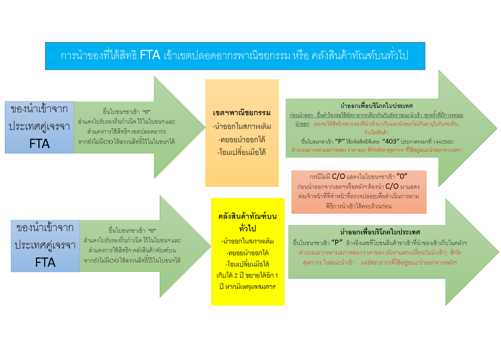

## General



**คำตอบ :**  

- ที่มา : [กรมศุลกากร](http://www.customs.go.th/cont_strc_faq.php?lang=th&top_menu=menu_homepage&left_menu=menu_center_004&ini_menu=&current_id=14232832414a505f4c464b47464b4b)  
- วันที่ปรับปรุงล่าสุด : 1 พฤษภาคม 2563  
 




## การชำระค่าภาษีอากรผ่านธนาคารทางอิเล็กทรอนิกส์ (e-Payment)

**คำตอบ :**  

- ที่มา : [กรมศุลกากร](http://ccc.customs.go.th/cont_strc_faq.php?current_id=14232a324148505f49&left_menu=interesting_article)  
- วันที่ปรับปรุงล่าสุด : 4 ตุลาคม 2562  
 




## การปฏิบัติพิธีการในการนำของที่ผลิตในประเทศเข้าไปบรรจุในเขตปลอดอากร/เขตประกอบการเสรีและขอใช้สิทธิชดเชยค่าภาษีอากรเมื่อส่งออก

**คำตอบ :**  

- ที่มา : [กรมศุลกากร](http://ccc.customs.go.th/cont_strc_faq.php?current_id=14232a324149505f47&left_menu=interesting_article)  
- วันที่ปรับปรุงล่าสุด : 26 ธันวาคม 2562  
 




## การใช้มาตร 12 และมาตร 14 แห่งพระราชกำหนดพิกัดอัตราภาษีศุลกากร แตกต่างกันอย่างไร 

**คำตอบ :**  

- **มาตรา 12**  เป็นการออกประกาศกระทรวงการคลังเพื่อประโยชน์แก่การเศรษฐกิจของประเทศ หรือเพื่อความผาสุกของประชาชน หรือเพื่อ ความมั่นคงของประเทศ ทั้งนี้ ตามมาตร 12 รัฐมนตรีว่าการกระทรวงการคลัง โดยความเห็นชอบของคณะรัฐมนตรีมีอำนาจประกาศลดอัตราอากร หรือยกเว้นอากรสำหรับของใด ๆ จากอัตราที่กำหนดไว้ในพิกัดอัตราศุลกากร หรือเรียกเก็บอากรพิเศษเพิ่มขึ้นสำหรับของใด ๆ ไม่เกินร้อยละห้าสิบของอัตราอากรที่กำหนดไว้ในพิกัดอัตราศุลกากร การออกประกาศกระทรวงการคลังตาม *มาตรา 12 เป็นการบังคับใช้กับสินค้าที่นำเข้าจากทุกประเทศ*  

- **มาตรา 14**  เป็นการออกประกาศกระทรวงการคลัง *เพื่อปฏิบัติตามข้อผูกพันตามสัญญา หรือความตกลงระหว่างประเทศ* ได้แก่ ปรับลดอัตราอากรขาเข้าภายใต้กรอบ FTA ต่าง ๆ ทั้งนี้ ตามมาตร 14 รัฐมนตรีว่าการกระทรวงการคลัง โดยความเห็นชอบขังคณะรัฐมนตรี มี อำนาจประกาศ ยกเว้น ลด หรือเพิ่มอัตราอากรจากอัตราที่กำหนดไว้ในพิกัดอัตราศุลกากรหรือประกาศเรียกเก็บอากร ตามอัตราที่กำหนดไว้ใน พิกัดอัตราศุลกากร สำหรับของที่มีถิ่นกำเนิดจากประเทศที่ร่วมลงนามหรือลักษณะตามที่ระบุไว้ในสัญญา หรือความตกลงดังกล่าว

> ที่มา : [สำนักนโยบายภาษี สำนักงานเศรษฐกิจการคลัง](http://www2.fpo.go.th/FPO/index2.php?mod=Content&file=contentview&contentID=CNT0000724&categoryID=CAT0000102) 
 




## Error "Paperless service is suspended because you have not paid service fee to Customs Department" หรือ "Paperless service is suspended because you have not paid overtime fee to Customs Department"

**คำตอบ :**  

 สาเหตุที่ผู้ประกอบการไม่ได้รับเลขที่ใบขนสินค้าในระบบ Paperless เนื่องมาจากสาเหตุหลัก 3 เรื่อง ดังนี้

1. ผู้ประกอบการค้างชำระค่าธรรมเนียมการผ่านพิธีการใบขนสินค้า    
2. ผู้ประกอบการค้างชำระค่าธรรมเนียมการตรวจปล่อยนอกเวลาราชการ (Overtime fee) สำหรับใบขนสินค้าขาออกที่ส่งออกนอกราชอาณาจักรที่มีคำสั่ง “ให้เปิดตรวจ”
3. กรณีมีการตรวจสอบข้อมูลทางสถิติ แล้วพบความผิดปกติของข้อมูล  

รายละเอียดของแต่ละสาเหตุมีดังนี้

1. ผู้ประกอบการค้างชำระค่าธรรมเนียมการผ่านพิธีการใบขนสินค้า

ค่าธรรมเนียมการผ่านพิธีการใบขนสินค้า ( Service fee ) เป็นค่าธรรมเนียมที่กรมศุลกากรเรียกเก็บจากใบขนสินค้าขาเข้า และใบขนสินค้าขาออก ที่มีสถานะตรวจปล่อยแล้ว ฉบับละ 200 บาท ผู้ประกอบการสามารถชำระได้ทันทีที่ยื่นใบขนสินค้า หรือ ชำระเป็นรายเดือน ณ สำนักงานศุลกากรทุกแห่ง โดยในแต่ละเดือนกรมศุลกากรรวบรวมข้อมูลใบขนสินค้าที่ต้องชำระค่าธรรมเนียม โดยแบ่งเป็นใบขนสินค้าที่ชำระแล้ว กับ ใบขนสินค้าที่ค้างชำระ และส่งใบแจ้งยอดค่าธรรมเนียมรายเดือนให้ผู้ประกอบการทราบทางไปรษณีย์ทุกเดือนในเดือนถัดไป เช่น ใบแจ้งหนี้ของเดือนมิถุนายนจะเป็นการสรุปค่าธรรมเนียมการผ่านพิธีการของใบขนสินค้าที่ตรวจปล่อยในเดือนพฤษภาคม  ผู้ประกอบการที่ไม่ไปดำเนินการชำระค่าธรรมเนียมภายในเวลาที่กำหนด กรมศุลกากรจะไม่อนุญาตให้ปฏิบัติพิธีการ

ท่านสามารถตรวจสอบข้อมูลผ่านระบบ e-Tracking ในหน้าเว็บไซต์ของกรมศุลกากร เมนูย่อย “e-Tracking System”

2. ผู้ประกอบการค้างชำระค่าธรรมเนียมการตรวจปล่อยนอกเวลาราชการ (Overtime fee) สำหรับใบขนสินค้าขาออกที่ส่งออกนอกราชอาณาจักรที่มีคำสั่ง **“ให้เปิดตรวจ”**

การขอให้เจ้าหน้าที่ศุลกากรตรวจปล่อยสินค้า หรือ ดำเนินการใด ๆ นอกเวลาราชการตามที่กฎหมายกำหนด  ผู้ประกอบการต้องชำระค่าธรรมเนียมการดำเนินการนอกเวลาราชการตามอัตราที่กำหนดในกฎหมาย  ใบขนสินค้าขาออกที่ได้รับคำสั่ง “ให้เปิดตรวจ”  หากขนย้ายมายังท่าส่งออกนอกเวลาราชการ  เจ้าหน้าที่ศุลกากรที่ท่าปลายทางจะดำเนินการตรวจสอบสินค้า และผู้ประกอบการต้องชำระค่าธรรมเนียมดังกล่าว  กรณีที่ไม่ชำระค่าธรรมเนียม เจ้าหน้าที่ศุลกากรจะออกประกาศแจ้งรายชื่อผู้ประกอบการที่ค้างชำระค่าธรรมเนียมติดประกาศไว้ที่สำนักงานศุลกากร เพื่อให้ผู้ประกอบการตรวจสอบและมาขอรับใบสั่งเก็บเงินไปชำระค่าธรรมเนียม กรณีพ้นกำหนด สำนักงานศุลกากรจะออกหนังสือแจ้ง ผู้ส่งออกเพื่อให้มาชำระค่าธรรมเนียม และหากเลยเวลาที่กำหนด ผู้ประกอบการยังไม่ชำระค่าธรรมเนียม กรมศุลกากรจะงดรับปฏิบัติพิธีการศุลกากรทางอิเล็กทรอนิกส์ทันที 

     
แผนภูมิขั้นตอนการชำระค่าธรรมเนียมตามใบสั่งเก็บเพื่อให้ชำระค่าทำการนอกเวลาราชการ

3. กรณีมีการตรวจสอบข้อมูลทางสถิติ แล้วพบความผิดปกติของข้อมูล และมีหนังสือแจ้งผู้นำของเข้า ให้ผู้นำของเข้าที่ได้รับหนังสือแจ้งมาชี้แจงข้อเท็จจริงพร้อมยื่นเอกสารประกอบการพิจารณาภายใน  15 วันนับแต่วันที่ได้รับหนังสือของกรมศุลกากร โดยให้มีหนังสือแจ้งเป็นจำนวน 2 ครั้ง  หากไม่มาภายในกำหนด จะมีหนังสือแจ้งตัวแทนออกของให้มาชี้แจงภายใน 15 วัน นับแต่ได้รับหนังสือของกรมศุลกากร หากผู้นำของเข้าหรือตัวแทนไม่มาภายในกำหนด จะงดรับปฏิบัติพิธีการศุลกากร

>- ที่มา : กรมศุลกากร
>- วันที่ปรับปรุงล่าสุด : 8 สิงหาคม 2562
 




## การสำแดงเลข e-tax incentive (เลข 14 หลัก) ในใบขนสินค้าขาเข้า-ใบขนสินค้าขาออกที่ใช้สิทธิประโยชน์ฯ ตามมาตรา 29 ต้องใส่เลขของผู้นำเข้าหรือผู้ส่งออก อย่างไร

**คำตอบ :**  

 ใบขนสินค้าขาเข้า ในส่วนรายการแต่ละรายการที่ใช้สิทธิการคืนอากรตามมาตรา 29   ต้องสำแดงเลข e-tax incentive ของผู้นำเข้าวัตถุดิบจากต่างประเทศที่ได้รับอนุมัติหลักการคืนอากรตามมาตรา 29  และในใบขนสินค้าขาออกต้องสำแดงเลข e-tax incentive ของผู้ส่งออกผลิตภัณฑ์ไปต่างประเทศ

- ที่มา : กรมศุลกากร  
- วันที่ปรับปรุงล่าสุด : 8 สิงหาคม 2562 
 




## ต้องการทราบว่ากรณีสินค้าที่ผลิตในราชอาณาจักรแล้วส่งออกไปเก็บไว้ยังต่างประเทศ หากนำเข้ามาขายในประเทศไทยจะได้รับยกเว้นอากรหรือไม่

**คำตอบ :**  

 พ.ร.ก.พิกัดอัตราศุลกากร พ.ศ.2530 ภาค 4 ประเภท 1  บัญญัติให้ยกเว้นอากรขาเข้ากับสินค้านำเข้าที่พิสูจน์ได้ว่า  เป็นสินค้าที่ผลิตในราชอาณาจักรและไม่ได้ใช้สิทธิประโยชน์ทางภาษีอากรใดๆที่ได้ส่งออกไปต่างประเทศและนำกลับเข้ามาโดยไม่เปลี่ยนแปลงลักษณะหรือรูป    หรือ เป็นสินค้าต่างประเทศที่ได้เคยนำเข้ามาในประเทศไทยและชำระค่าภาษีอากรและได้ส่งออกไปต่างประเทศโดยไม่ได้ขอคืนอากรขาเข้า    และได้นำกลับเข้ามาโดยไม่เปลี่ยนแปลงลักษณะหรือรูปร่าง     ดังนั้นหากสินค้าของท่านเป็นไปตามข้อกำหนดดังกล่าว โดยสามารถพิสูจน์ตามหลักเกณฑ์เงื่อนไขที่กรมศุลกากรกำหนด    การนำกลับเข้ามาขายในประเทศจะไม่ต้องเสียภาษีอากรขาเข้า  แต่หากไม่เป็นไปตามหลักเกณฑ์ดังกล่าว  ของนั้นต้องชำระค่าภาษีอากร

- ที่มา : กรมศุลกากร  
- วันที่ปรับปรุงล่าสุด : 8 สิงหาคม 2562  
 




## ต้องการทราบรายละเอียดค่าใช้จ่ายในการดำเนินพิธีการศุลกากร

**คำตอบ :**  

 พ.ร.ก.พิกัดอัตราศุลกากร พ.ศ.2530 ภาค 4 ประเภท 1  บัญญัติให้ยกเว้นอากรขาเข้ากับสินค้านำเข้าที่พิสูจน์ได้ว่า  เป็นสินค้าที่ผลิตในราชอาณาจักรและไม่ได้ใช้สิทธิประโยชน์ทางภาษีอากรใดๆที่ได้ส่งออกไปต่างประเทศและนำกลับเข้ามาโดยไม่เปลี่ยนแปลงลักษณะหรือรูป    หรือ เป็นสินค้าต่างประเทศที่ได้เคยนำเข้ามาในประเทศไทยและชำระค่าภาษีอากรและได้ส่งออกไปต่างประเทศโดยไม่ได้ขอคืนอากรขาเข้า    และได้นำกลับเข้ามาโดยไม่เปลี่ยนแปลงลักษณะหรือรูปร่าง     ดังนั้นหากสินค้าของท่านเป็นไปตามข้อกำหนดดังกล่าว โดยสามารถพิสูจน์ตามหลักเกณฑ์เงื่อนไขที่กรมศุลกากรกำหนด    การนำกลับเข้ามาขายในประเทศจะไม่ต้องเสียภาษีอากรขาเข้า  แต่หากไม่เป็นไปตามหลักเกณฑ์ดังกล่าว  ของนั้นต้องชำระค่าภาษีอากร

- ที่มา : กรมศุลกากร  
- วันที่ปรับปรุงล่าสุด : 5 มิถุนายน 2561  





**คำตอบ :**  

- สามารถเข้าไปตรวจสอบได้ที่เว็บไซต์กรมศุลกากร ระบบ e-tracking (http://e-tracking.customs.go.th/ETS/index.jsp?lang=th&left_menu=nmenu_esevice_002) 

- ไปที่เมนู “Vessel” 

- ใส่รายละเอียดที่ต้องการในแต่ละช่อง แล้วกด "search" ดังตัวอย่าง

- ที่มา : กรมศุลกากร  
- วันที่ปรับปรุงล่าสุด : 22 กุมภาพันธ์ 2562  

