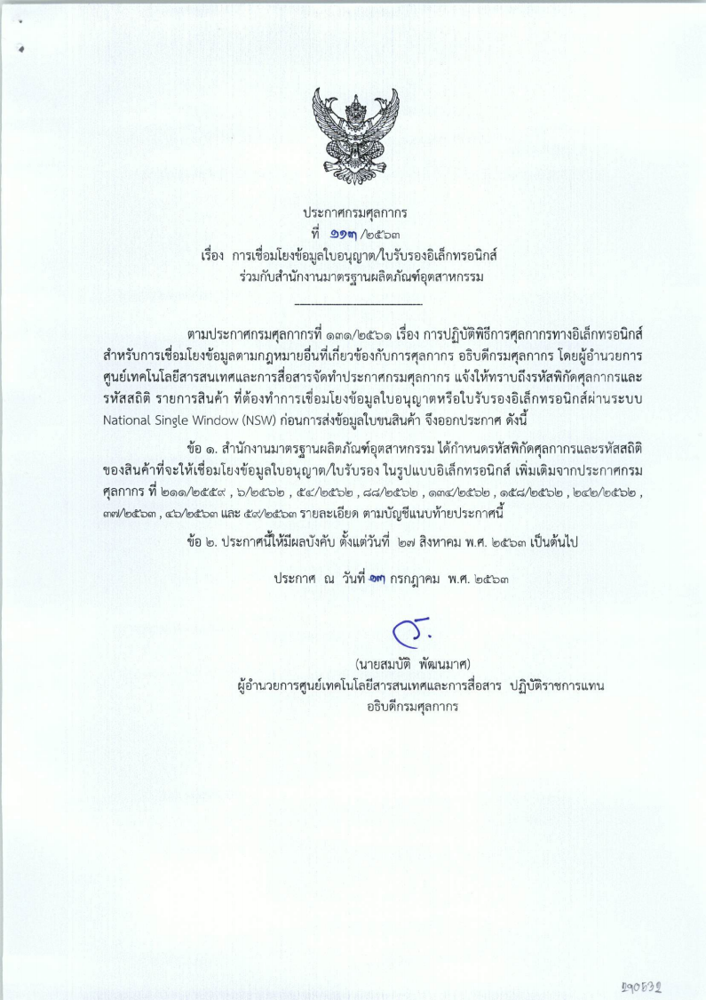
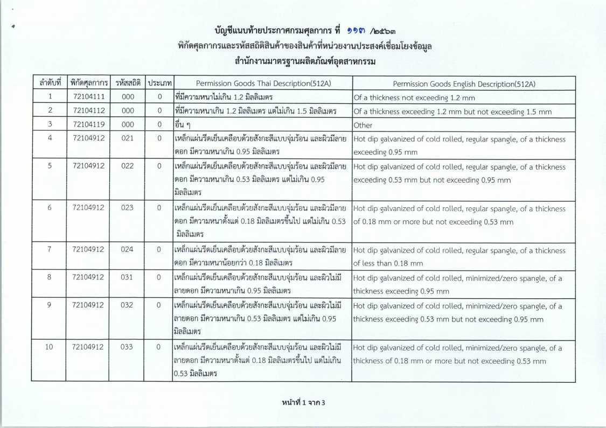
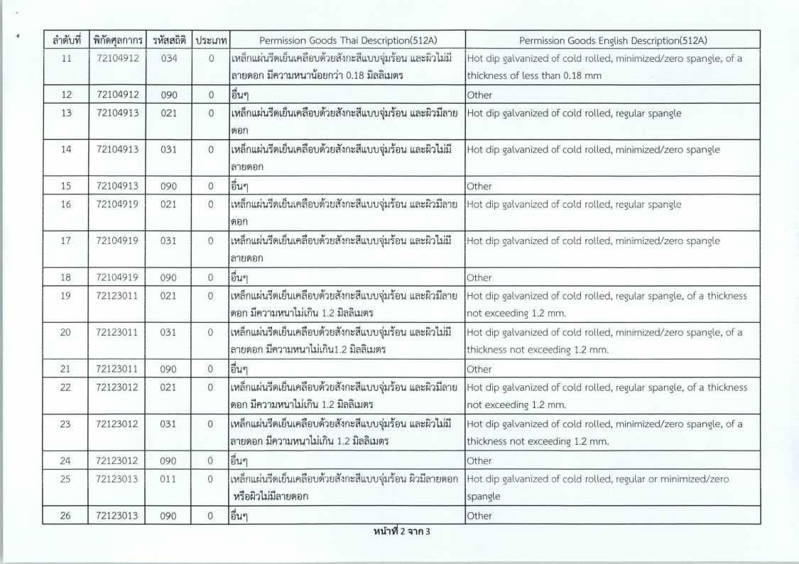
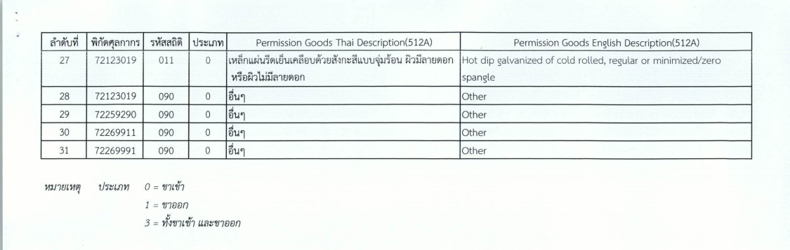

## ประกาศกรมศุลกากรที่ 113/.2563 เรื่อง การเชื่อมโยงข้อมูลใบอนุญาต/ใบรับรองอิเล็กทรอนิกส์ร่วมกับสำนักงานมาตรฐานผลิตภัณฑ์อุตสาหกรรม.   

มีผลบังคับตั้งแต่*วันที่ 27 สิงหาคม 2563* เป็นต้นไป

> ที่มา : [กรมศุลกากร](./2563-113.pdf)
