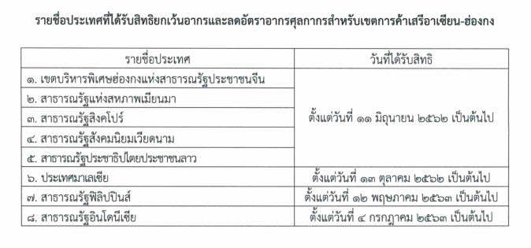

ประกาศกรมศุลกากรที่ 107/.2563 เรื่อง แก้ไขเพิ่มเติมประกาศกรมศุลกากรที่ 89/2562 เพื่อปรับปรุงรายชื่อประเทศที่ได้รับสิทธิยกเว้นอากรและลดอัตราอากรศุลกากรสำหรับเขตการค้าเสรีอาเซียน-ฮ่องกง



> ที่มาบทความ : [กรมศุลกากร](http://th.customs.go.th/cont_strc_download_with_docno_date.php?lang=th&top_menu=menu_homepage&current_id=14232832414b505f46464b4d464b4a)
