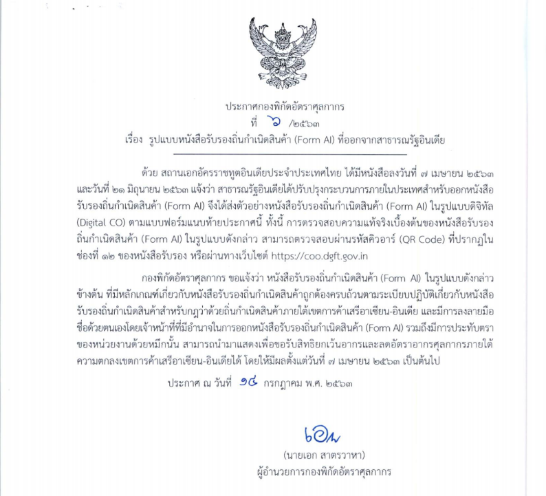

## ประกาศกองพิกัดอัตราศุลกากรที่ 6/.2553 เรื่อง รูปแบบหนังสือรับรองถิ่นกำเนิดสินค้า (Form AI) ที่ออกจากสาธารณรัฐอินเดีย.  

มีผลบังคับตั้งแต่*วันที่ 14 กรกฎาคม 2563* เป็นต้นไป

> ที่มา : [กรมศุลกากร](./FormAI_2563-07.pdf)
